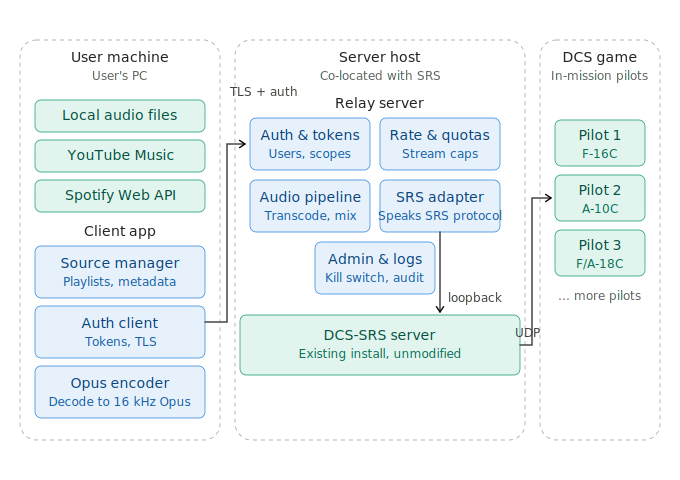

# StratoCast

Client/server music streaming for DCS-SRS. Authorised users push audio to in-game radio frequencies from their own machine. The relay on the server side keeps the flood risks in check.

Good for mission ambience, in-universe radio stations, or a running ATIS-style feed.

## Status

Early days. Nothing runs yet. This repo is the plan and the architecture; code is on its way.

## Thanks to ace747

The whole idea here started with [SR-Music](https://github.com/ace747/SR-Music) by [ace747](https://github.com/ace747). SR-Music is a local, admin-controlled music client for SRS and it does that job well. StratoCast is what you end up with if you try to bolt remote access and user auth onto the same concept without just accepting the audio-flood problem that comes with it.

If one operator pushing music over SRS on a single box is all you need, go use SR-Music.

## What StratoCast plans to do:

MVP:

- Authenticated client over TLS with per-user tokens.
- Local file streaming: MP3, FLAC, OGG, WAV.
- Audio injection into a running DCS-SRS server on whatever frequency you assign.
- Per-user quotas, frequency allowlists, a global kill switch.
- Audit log of who transmitted what, where, and when.

Later:

- Multiple simultaneous streams per server.
- Playlist queueing and crossfade.
- YouTube Music via ytmusicapi (bring your own credentials).
- Spotify, if I can find a way that doesn't run foul of their ToS.

Long shot:

- Tie transmissions to an in-mission unit the way LotATC does, so SRS's line-of-sight and distance rules actually apply. Needs a Lua export hook on the DCS side and is a big enough job to be its own milestone.

## How it hangs together

Three pieces.

**Client** on your PC. Picks a source, builds a playlist, encodes to Opus, ships it to the relay.

**Relay** runs on the same host as DCS-SRS. Terminates the client connection, checks auth and quotas, transcodes if it has to, hands audio to SRS over loopback like any other SRS client would.

**DCS-SRS** is unmodified. You don't replace it or patch it. The relay just pretends to be a client.

Pilots tune their aircraft radio to the frequency you've set. That's it.

The relay exists so the client can live anywhere without SRS needing to know anything about users, tokens, or abuse. The only public endpoint is the relay. If someone nicks a token, whatever quotas you set still apply to them.

## Getting started

Not there yet. Keep an eye on the releases page.

When it runs, you'll need:

- A working [DCS-SimpleRadioStandalone](https://github.com/ciribob/DCS-SimpleRadioStandalone) server.
- A host that can reach SRS over loopback. Same box is fine and recommended.
- TLS certs for the relay's public endpoint.

## Config

Relay config will sit in a file next to the binary, probably TOML. Sections I'm planning:

- `[server]` : bind address, TLS certs, SRS endpoint.
- `[auth]` : token store, expiry, issuer.
- `[quotas]` : concurrent stream and bitrate caps.
- `[frequencies]` : allowlists and per-role rules.
- `[admin]` : admin UI details.

A sample config will ship with the first working release.

## A note on streaming services

Local files are the safe primary source. Anything external gets murkier.

**ytmusicapi** sits in a grey area with YouTube's ToS. You provide your own credentials. Your call on whether to use it.

**Spotify's Web API** explicitly bans redistributing audio. If Spotify support happens at all, it'd be metadata and playlist browsing only, with playback coming from a local copy you already own.

Running StratoCast on a public community server? Stick to local files.

## Contributing

PRs welcome. If it's small, just send it. If it touches auth, quotas, or the SRS adapter, open an issue first so we can talk through the approach before you sink hours into it.

A proper `CONTRIBUTING.md` and dev setup guide will land with the MVP.

## Licence

## Credits

- [SR-Music](https://github.com/ace747/SR-Music) by ace747 : the project that inspired this one.
- [DCS-SimpleRadioStandalone](https://github.com/ciribob/DCS-SimpleRadioStandalone) by Ciribob : the whole reason any of this is possible.
- [LotATC](https://www.lotatc.com/) : for showing how a third-party tool binds SRS transmissions to in-game units.

## Disclaimer

Not affiliated with Eagle Dynamics, Ciribob, or ace747. "DCS World" is a trademark of Eagle Dynamics SA.
